# 🔥 Polissya Wildfire Risk

**A dynamic day-ahead wildfire risk forecasting system for the Ukrainian Polissya forest belt, built from satellite fire detections and reanalysis weather data.**

[](https://www.python.org/)
[](https://www.tensorflow.org/)
[](https://scikit-learn.org/)
[](notebooks/polissya_wildfire_risk.ipynb)
[](LICENSE)
[](#about-the-project)
[](https://colab.research.google.com/github/blaz3xx/polissya-wildfire-risk/blob/main/notebooks/polissya_wildfire_risk.ipynb)

*[Українська версія](README.uk.md)*

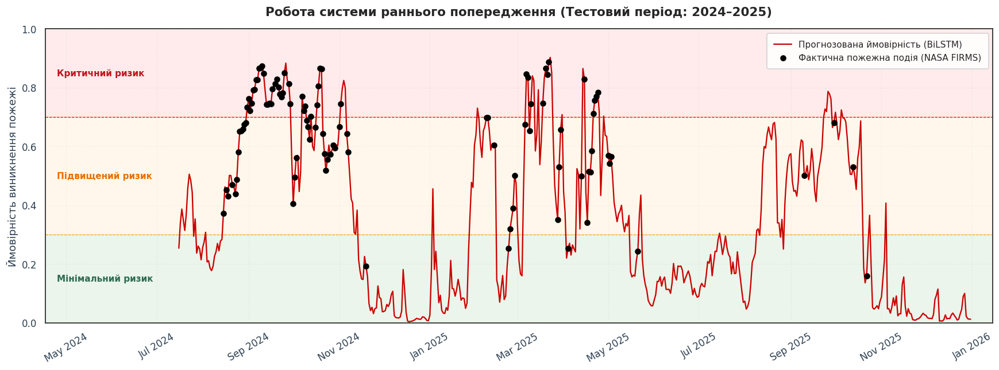
<sub>The trained model running over the 2024–2025 hold-out period. The red line is the predicted daily probability of significant fire activity; black dots are days on which NASA FIRMS actually recorded fires in the forest mask. Background bands are the three alert tiers. Axis labels are in Ukrainian, since the notebook was written for a Ukrainian audience.</sub>

---

## TL;DR

Ten years of daily weather (2016–2025) over the Polissya forest zone are joined with satellite fire detections to answer one question: **given the last 14 days of weather, how likely is a significant fire day tomorrow?**

A bidirectional LSTM reaches **ROC-AUC 0.877 and recall 0.922** on a strictly chronological hold-out set, beating logistic regression, random forest, and CatBoost baselines. Predictions feed a three-tier alert system, and a live module pulls today's weather from the Open-Meteo forecast API to produce a current risk reading.

| | |
|---|---|
| **Region** | Ukrainian Polissya, 50.5–52.5°N / 23.5–34.0°E |
| **Period** | 2016-01-01 → 2025-12-31 (3,653 daily records) |
| **Forest mask** | 4,145 OSM polygons ≥ 2 km², 58,276 km² total |
| **Fire labels** | 17,669 forest-clipped FIRMS detections, 468 significant fire days |
| **Features** | 161 predictors, 121 of them engineered |
| **Best model** | BiLSTM, 50,977 parameters, 14-day input window |

---

## Table of contents

- [About the project](#about-the-project)
- [Why this problem](#why-this-problem)
- [Data sources](#data-sources)
- [Pipeline](#pipeline)
- [Building the study area](#building-the-study-area)
- [Labelling fire days](#labelling-fire-days)
- [Exploratory analysis](#exploratory-analysis)
- [Feature engineering](#feature-engineering)
- [Modelling](#modelling)
- [Results](#results)
- [What the model actually learned](#what-the-model-actually-learned)
- [From probability to alert](#from-probability-to-alert)
- [Live forecasting](#live-forecasting)
- [Repository structure](#repository-structure)
- [Getting started](#getting-started)
- [Limitations](#limitations)
- [Roadmap](#roadmap)
- [References](#references)
- [Authors and license](#authors-and-license)

---

## About the project

This work was produced as a pilot contribution to **Erasmus+ EcoMinds: Enhancing Environmental Data Collection through Machine Learning and Database Systems**, and submitted as a second-year coursework project in the *Data Analysis in Information Systems* course at the **Department of Informatics and Software Engineering, Igor Sikorsky Kyiv Polytechnic Institute (NTUU KPI)**.

The EcoMinds brief asks students to take a real environmental problem end to end: find the data, clean it, model it, evaluate it honestly, and think about what the result means in practice. This repository is that whole path, kept in one runnable notebook.

The full explanatory report (47 pages, Ukrainian) is in [`docs/report/`](docs/report/), and the methodology is summarised in English in [`docs/METHODOLOGY.md`](docs/METHODOLOGY.md).

## Why this problem

Polissya is the peat-rich forest belt across northern Ukraine. It burns in a way most temperate forests do not: peat holds fire underground for weeks, spring and late-summer fires recur on a schedule, and parts of the zone overlap the Chornobyl exclusion area, where a fire is also a radionuclide transport event.

Fire services need to know where to pre-position people, and the honest constraint is that nobody can staff a red alert every day. A system that is right about *when* to worry is worth more than a system that is merely accurate on average, and that shaped every evaluation choice below: recall on fire days matters more than raw accuracy, and the threshold was tuned for it.

## Data sources

| Source | What it provides | How it is used |
|---|---|---|
| [Open-Meteo Historical Weather API](https://open-meteo.com/en/docs/historical-weather-api) | ERA5 reanalysis, ~25 km resolution, free, no key | Daily weather for each grid node, 2016–2025 |
| [Open-Meteo Forecast API](https://open-meteo.com/en/docs) | Recent observations plus short-range forecast | Live inference module (Phase 5) |
| [NASA FIRMS](https://firms.modaps.eosdis.nasa.gov/) | Active fire detections from MODIS Aqua/Terra and VIIRS S-NPP / NOAA-20 | Target variable |
| [OpenStreetMap](https://www.openstreetmap.org/) via OSMnx | `landuse=forest`, `natural=wood` polygons | Spatial mask defining the study area |

All four are open and free. FIRMS requires a [free MAP_KEY](https://firms.modaps.eosdis.nasa.gov/api/map_key/); everything else works without registration.

## Pipeline

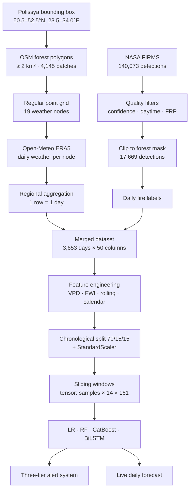

## Building the study area

The naive approach would be to pick a handful of cities and download their weather. That measures the weather of cities, not of forests.

Instead the area is defined as the intersection of three things: the Polissya bounding box, OSM forest polygons of at least 2 km² (which drops parks and roadside tree lines), and the Ukrainian administrative border. That leaves **4,145 forest patches covering 58,276 km²**. A regular grid is laid inside the mask, giving **19 sampling nodes**, each roughly matching one ERA5 cell.

Open-Meteo accepts a coordinate, not a polygon, so "the weather of the zone" is approximated by averaging a grid dense enough to cover it. Each node's series is downloaded, cached to disk per year and per batch, and then aggregated to a single regional row per day, keeping mean, regional max, and regional min for each variable. The regional extremes matter: a fire starts where conditions are worst, not where they are average.

Two engineering details make the notebook re-runnable in a normal Colab session. Forest geometries are simplified to a ~100 m tolerance before `unary_union`, because unioning tens of thousands of detailed polygons exhausts memory. And every API response is cached to Drive, so a second run costs seconds instead of 100 API calls.

## Labelling fire days

FIRMS is a detection feed, not a fire database, so the raw 140,073 detections need work before they can be a target:

| Filter | Remaining | Share |
|---|---|---|
| Raw detections in bounding box | 140,073 | 100.0% |
| Confidence level (nominal/high) | 119,132 | 85.0% |
| Daytime overpasses only | 78,734 | 66.1% |
| Brightness temperature ≥ 300 K | 78,734 | 100.0% |
| **Inside the forest mask** | **17,669** | **22.4%** |

The last row is the important one. Only about a fifth of thermal anomalies in the region are forest fires. The rest are overwhelmingly agricultural stubble burning, which follows harvest logic rather than fire-weather logic. Leaving them in the target would have taught the model to predict farming schedules.

After clipping, 1,165 days carry at least one forest detection (31.9% of the record). The binary target used for modelling is the stricter **significant fire day**, which is positive on 468 days (12.8%). The strongest single event in the decade reached 2,174 MW of fire radiative power.

## Exploratory analysis

Ten visualisations were produced before any modelling. Four of the more informative ones:

<table>
<tr>
<td width="50%">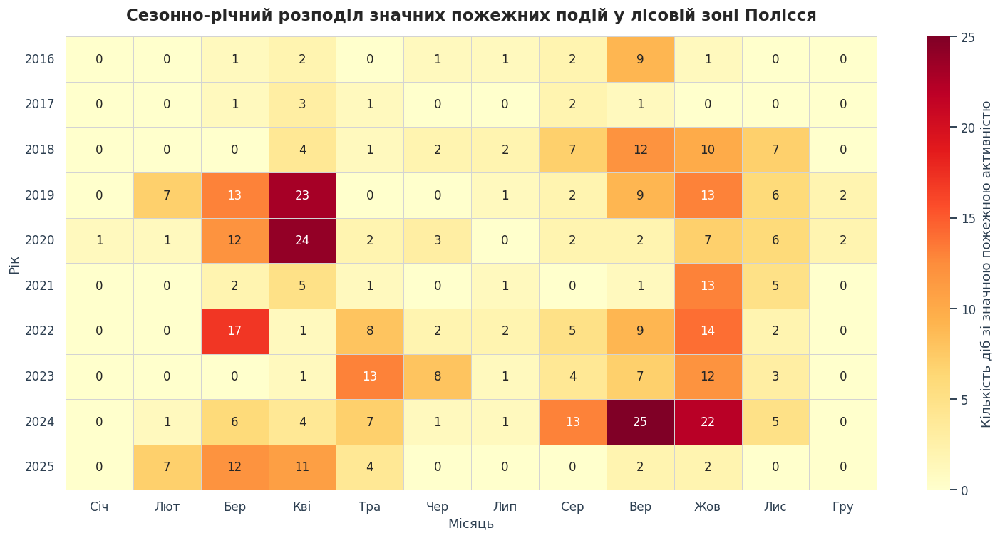<br/><sub><b>Seasonality.</b> Fire days by year and month. Two peaks: a spring one after snowmelt and before green-up, and a stronger late-summer one in August–October.</sub></td>
<td width="50%">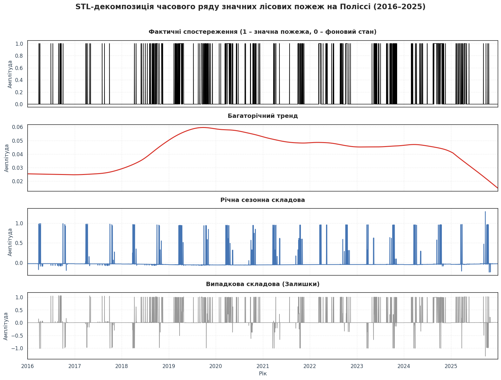<br/><sub><b>STL decomposition</b> of fire activity into trend, annual seasonality, and residual, confirming a stable 365-day cycle.</sub></td>
</tr>
<tr>
<td width="50%">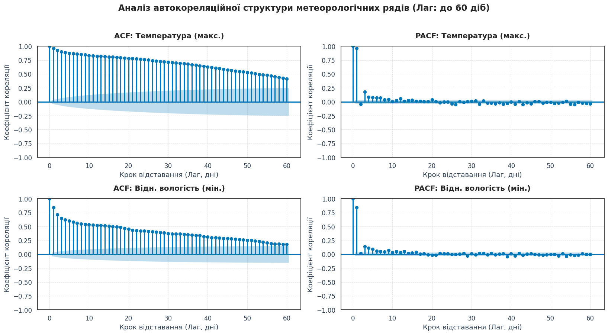<br/><sub><b>Autocorrelation.</b> The PACF cutoff is what set the model's 14-day input window. It is a data-driven choice, not a round number.</sub></td>
<td width="50%">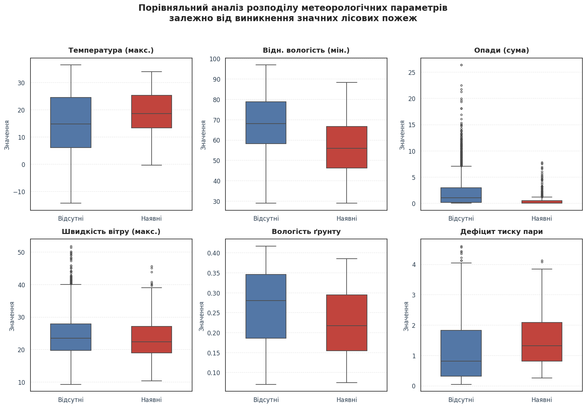<br/><sub><b>Class separation.</b> Weather distributions on fire days versus quiet days. Humidity and vapour pressure deficit separate the classes most cleanly.</sub></td>
</tr>
</table>

<details>
<summary><b>More EDA figures</b> (correlation matrix, kernel densities, wind rose)</summary>

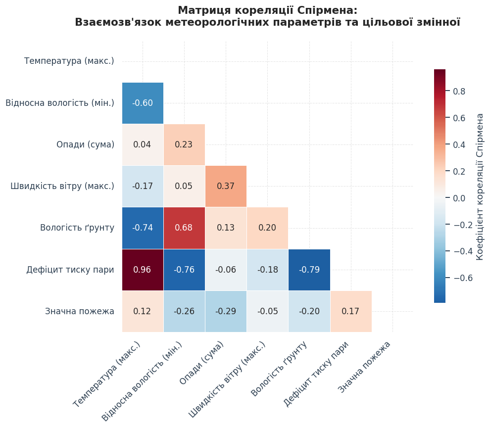
*Spearman rank correlation between weather predictors. Spearman rather than Pearson, because several relationships here are monotone but not linear.*

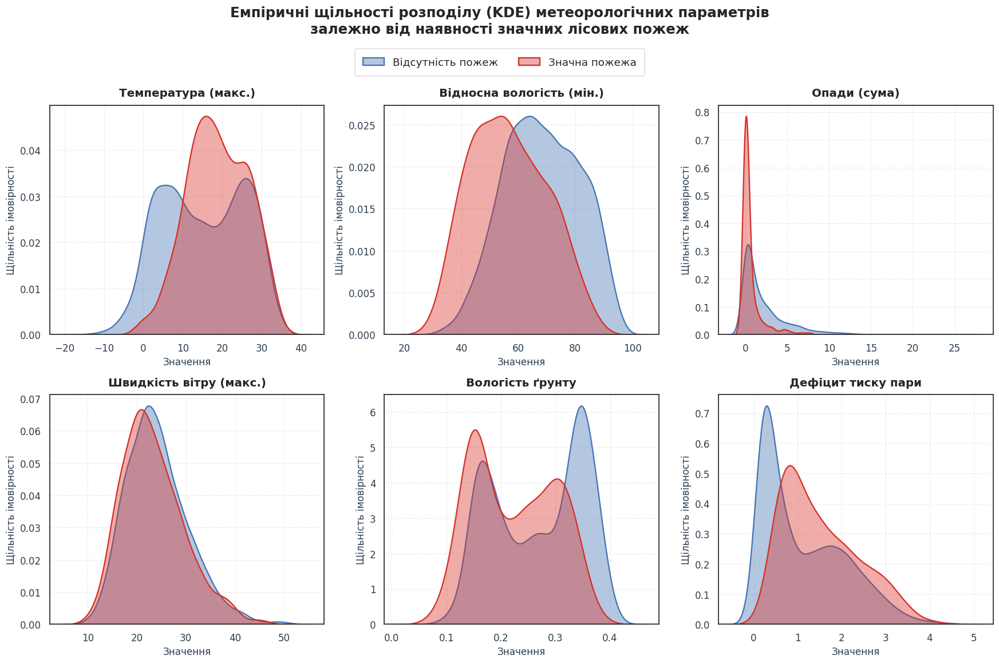
*Kernel density estimates of key predictors, split by class.*

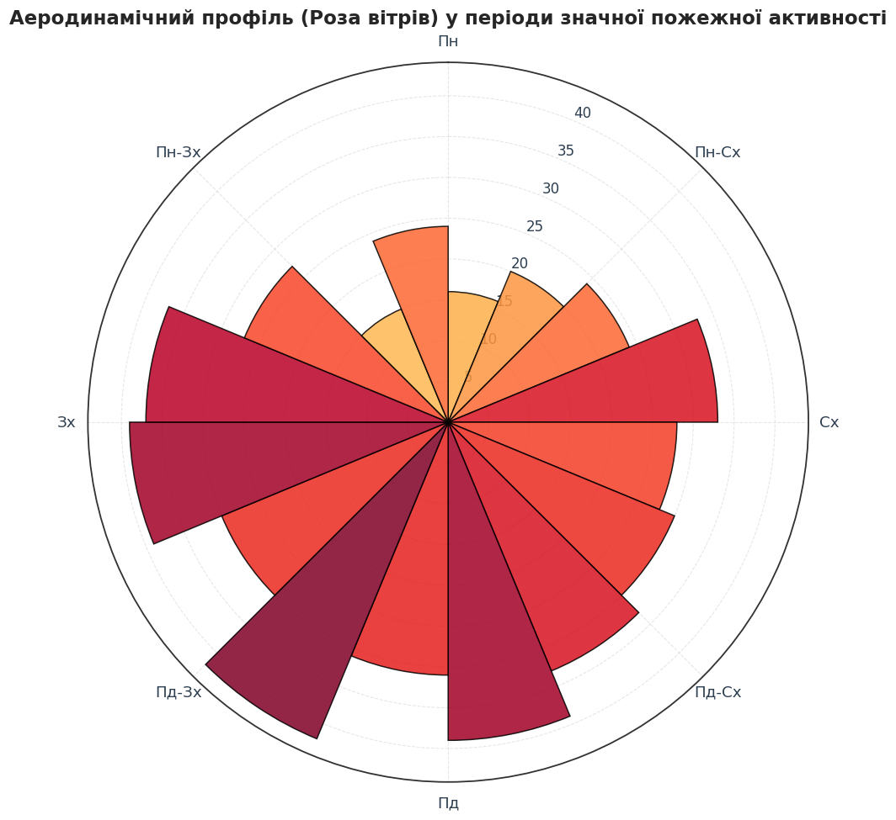
*Wind rose for significant fire days, showing the dominant direction and speed regime when fires occur.*

</details>

An Augmented Dickey-Fuller test rejects the unit root for both the temperature series (p = 3.9e-03) and the relative humidity series (p = 2.0e-07), so the inputs are stationary enough to model directly.

## Feature engineering

121 features were derived from the raw weather, giving 161 predictors after selection:

- **Vapour pressure deficit (VPD)** from the Tetens equation. Mean 0.381 kPa, max 1.80 kPa. VPD is physically closer to "how fast fuel dries" than temperature or humidity alone.
- **Canadian Fire Weather Index system**, the full recursive chain: FFMC → DMC → DC → ISI → BUI → FWI, implemented against Van Wagner & Pickett (1985). Each day's fuel moisture codes depend on the previous day's, so the series is walked sequentially with carried state. Mean FWI 2.55, max 30.3.
- **Dry spell length**, consecutive days below 1 mm of rain. The decade's longest ran 21 days.
- **Rolling statistics** over 3, 7, and 14-day windows: means, standard deviations, and cumulative sums for precipitation. 108 features.
- **Cyclical calendar encoding**, sine and cosine of day-of-year, so 31 December sits next to 1 January instead of on the opposite end of a line.

Fire-derived columns are dropped from the predictor set before training. Only weather goes in, which is what makes the system a forecast rather than a description.

## Modelling

**The split is chronological, never random.** Train covers 2016-01-01 to 2022-12-31, validation 2023-01-01 to 2024-07-01, test 2024-07-02 to 2025-12-31. Shuffling a time series here would let the model see next week's weather while predicting today, and would inflate every metric.

The scaler is fitted on the training split only. Sliding 14-day windows turn each split into a 3-D tensor of shape `(samples, 14, 161)`, giving 2,543 training / 534 validation / 534 test samples. Positive class weight is 7.59, which penalises missed fire days rather than letting the model collect an easy 87% by always predicting "no fire".

Four models compete on identical tensors. The three classical ones get the window flattened to 2,254 features; only the BiLSTM sees the time axis as a time axis:

```
Bidirectional(LSTM(32))   →  49,664 params
BatchNormalization        →     256
Dropout(0.3)
Dense(16, relu)           →   1,040
Dropout(0.2)
Dense(1, sigmoid)         →      17
                          ─────────
Total                        50,977
```

The classification threshold is chosen by maximising F1 **on the validation split**, then applied unchanged to the test split. No test-set information touches any training or tuning decision.

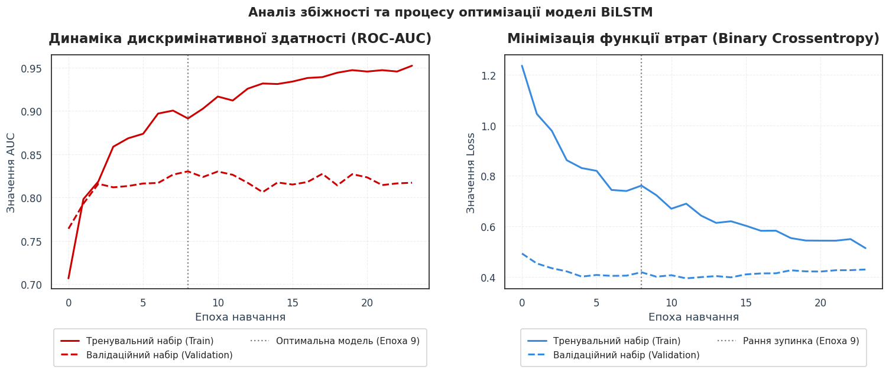
<sub>Validation AUC and loss per epoch, with the best-weights epoch marked. Early stopping restores that checkpoint.</sub>

## Results

All metrics on the untouched 2024–2025 hold-out set, where the base rate of significant fire days is 19.3%.

| Model | ROC-AUC | Avg. Precision | Precision | Recall | F1 |
|---|---|---|---|---|---|
| Logistic Regression | 0.748 | 0.415 | 0.407 | 0.534 | 0.462 |
| Random Forest | 0.872 | 0.529 | 0.524 | 0.107 | 0.177 |
| CatBoost | 0.834 | **0.607** | 0.396 | 0.650 | 0.493 |
| **BiLSTM** ⭐ | **0.877** | 0.577 | 0.401 | **0.922** | **0.559** |

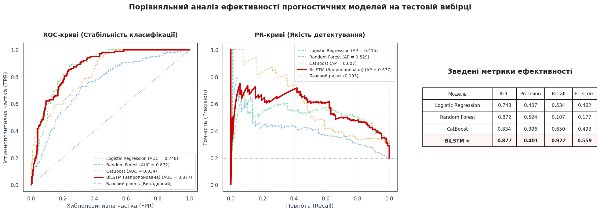

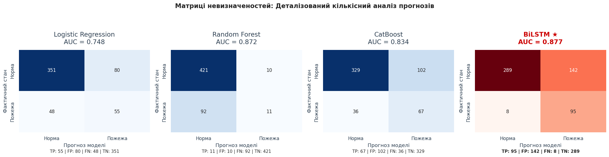

Reading this table honestly:

- **The BiLSTM wins where it counts.** Best AUC, best F1, and recall of 0.922 means it flags roughly 9 in 10 real fire days. For an early warning system, a false alarm costs a wasted patrol; a miss costs a forest.
- **Random Forest is a cautionary tale.** Its AUC of 0.872 looks competitive, but recall of 0.107 means it misses nearly 90% of fire days at the operating threshold. Ranking quality and decision quality are not the same thing, and AUC alone would have hidden this.
- **CatBoost has the best average precision**, so under a precision-first objective it would be the pick. The BiLSTM's advantage is specifically in not missing events.
- **Precision sits near 0.40 for every model.** Roughly three in five alerts are false. That is a real limitation, discussed [below](#limitations), and it is the honest cost of tuning for recall on a rare event.

The recurrent model's edge comes from being the only one that sees temporal structure explicitly. Fire risk is cumulative: two dry weeks are not the same as two dry days repeated, and a flattened feature vector makes that relationship something the model has to infer rather than something it is handed.

## What the model actually learned

Permutation importance was computed for the BiLSTM (20 shuffles per feature, measured as mean AUC drop), and gain-based importance for CatBoost as a cross-check.

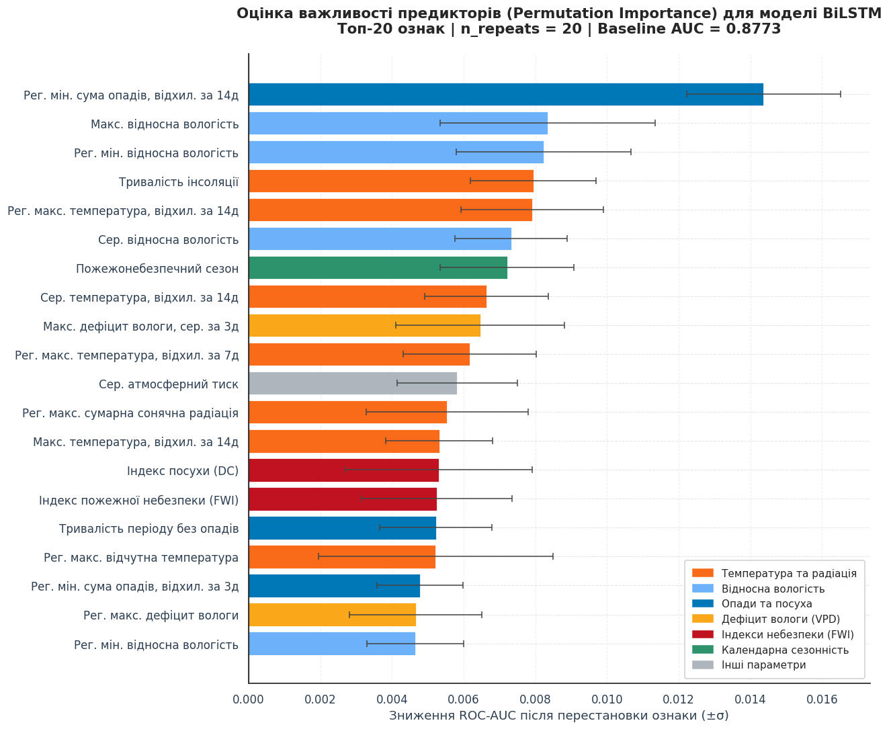

| Rank | Feature | ΔAUC |
|---|---|---|
| 1 | 14-day std. of minimum regional precipitation | 0.0144 ± 0.0021 |
| 2 | Maximum relative humidity | 0.0083 ± 0.0030 |
| 3 | Minimum regional relative humidity | 0.0082 ± 0.0024 |
| 4 | Sunshine duration | 0.0079 ± 0.0018 |
| 5 | 14-day std. of regional max temperature | 0.0079 ± 0.0020 |
| 6 | Mean relative humidity | 0.0073 ± 0.0016 |
| 7 | Fire season indicator | 0.0072 ± 0.0019 |

The top feature is a *variability* measure, not a level: how unevenly rain fell over the past fortnight matters more than how much fell. Steady drizzle keeps litter damp; the same total delivered in one storm followed by twelve dry days does not. Humidity dominates the next tier, and the FWI components (DC and FWI itself, ΔAUC ≈ 0.0053 each) contribute meaningfully, which is a nice independent confirmation that a fire-science index developed in Canada in 1985 still carries signal in Ukrainian peat forest.

<details>
<summary><b>CatBoost feature importance</b> (cross-check on flattened features)</summary>

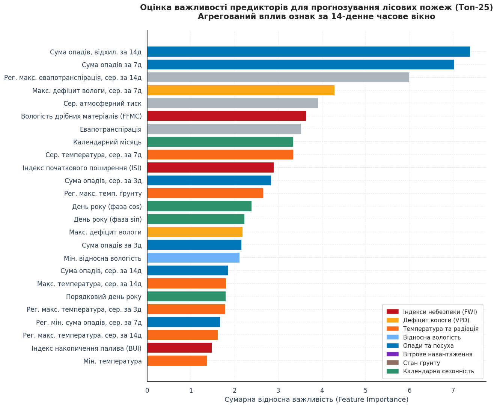

Importances are summed across all 14 time-step copies of each base feature, since flattening duplicates every predictor once per day in the window.

</details>

## From probability to alert

A probability is not an operational instruction, so the output is bucketed into three tiers:

| Tier | Probability | Recommended response | Share of test period |
|:---:|---|---|---|
| 🟢 **Green** | < 0.30 | Routine monitoring | 268 days (50.2%) |
| 🟠 **Orange** | 0.30 – 0.70 | Restrict forest access, ready crews | 194 days (36.3%) |
| 🔴 **Red** | > 0.70 | Pre-position aviation and firefighting units | 72 days (13.5%) |

Half the calendar stays green, and red fires only about one day in seven. That distribution is deliberate: an alert system that shouts constantly gets ignored, and one that never shouts is decorative.

## Live forecasting

Phase 5 closes the loop. It pulls current weather from the Open-Meteo forecast API for the same 19 nodes and produces today's risk reading.

The tricky part is warm-up. The FWI codes are recursive and the rolling windows need history, so scoring today's weather in isolation would produce garbage. The live module prepends a 400-day tail of archive data before recomputing features, which is long enough for the Drought Code to converge to a physically meaningful value. Fire columns are stripped from the historical tail so no label information leaks into inference.

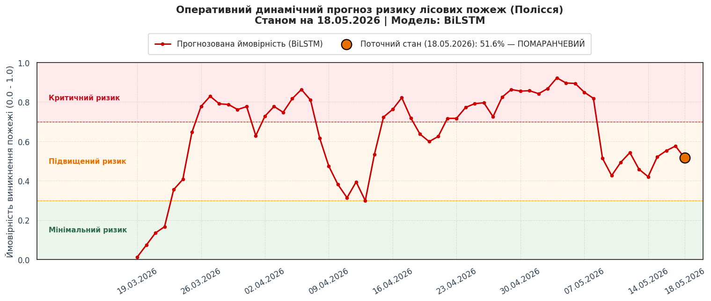

<sub>Output from the last recorded run, dated 18 May 2026: probability 51.6%, orange tier. The notebook also exports an animated Plotly map (`risk_animation.html`) showing risk evolving day by day across the region.</sub>

## Repository structure

```
polissya-wildfire-risk/
├── notebooks/
│   └── polissya_wildfire_risk.ipynb    # the full pipeline, phases 0–5
├── src/
│   ├── fwi.py                          # Canadian Fire Weather Index system
│   ├── features.py                     # VPD, dry spells, rolling stats, calendar
│   └── config.py                       # bounding box, dates, thresholds
├── docs/
│   ├── METHODOLOGY.md                  # English methodology summary
│   ├── RESULTS.md                      # full metrics and reproduction notes
│   └── report/
│       └── coursework-report-uk.docx   # full 47-page report (Ukrainian)
├── assets/                             # figures used in this README
├── requirements.txt
├── CITATION.cff
├── LICENSE
└── README.uk.md                        # Ukrainian version of this file
```

The notebook is the source of truth and runs top to bottom. The `src/` modules are the reusable pieces lifted out of it with English documentation, so you can compute a Fire Weather Index series without running the whole pipeline.

## Getting started

### Run it in Colab

The notebook was written for Google Colab and mounts Drive for caching. Open [`notebooks/polissya_wildfire_risk.ipynb`](notebooks/polissya_wildfire_risk.ipynb), add your FIRMS key to Colab Secrets as `FIRMS_MAP_KEY`, and run all cells. First run downloads roughly 100 API responses and caches them; later runs read from cache.

### Run it locally

```bash
git clone https://github.com/<your-username>/polissya-wildfire-risk.git
cd polissya-wildfire-risk

python -m venv .venv && source .venv/bin/activate   # Windows: .venv\Scripts\activate
pip install -r requirements.txt

export FIRMS_MAP_KEY="your_key_here"                # Windows: set FIRMS_MAP_KEY=...
jupyter lab notebooks/polissya_wildfire_risk.ipynb
```

The Drive mount fails gracefully outside Colab and falls back to a local `./forest_fire_project` directory.

### Use the modules on their own

```python
import pandas as pd
from src.fwi import add_fwi
from src.features import compute_vpd, days_without_rain, add_rolling, add_calendar

df = pd.read_csv("weather.csv", parse_dates=["date"])

df["vpd"] = compute_vpd(df["temperature_2m_mean"], df["relative_humidity_2m_mean"])
df["days_no_rain"] = days_without_rain(df["rain_sum"], threshold=1.0)
df = add_rolling(df, ["temperature_2m_mean", "rain_sum"], windows=(3, 7, 14))
df = add_calendar(df)
df = add_fwi(df)          # adds FFMC, DMC, DC, ISI, BUI, FWI

print(df[["date", "FFMC", "DMC", "DC", "ISI", "BUI", "FWI"]].tail())
```

### Reproducibility

Seeds are fixed for `random`, `numpy`, `PYTHONHASHSEED`, and TensorFlow (`RANDOM_STATE = 42`). Metrics still move by a percentage point or so across runs, mostly from GPU non-determinism in cuDNN kernels. The reported numbers come from a single CPU run; treat differences under ~0.01 AUC as noise.

## Limitations

Stated plainly, because a model deployed without them is a liability:

- **Precision is about 0.40.** Roughly three in five alerts do not correspond to a detected fire day. Some of those are near-misses where conditions were genuinely dangerous and ignition simply did not occur, but they are false alarms to whoever is on shift.
- **ERA5's ~25 km grid cannot see inside a forest.** Local microclimate, canopy shading, and valley effects are all averaged away.
- **No human factors.** Ignition is overwhelmingly anthropogenic, yet the model has no population density, road access, powerline, or holiday-weekend variables. It predicts *fire weather*, then leans on the historical fact that ignition sources are effectively always present.
- **The label is a proxy.** FIRMS sees what satellites overpass in clear sky. Small fires, night fires, and cloudy days are under-detected, so "no detection" is not the same as "no fire".
- **One region, one decade.** Nothing here is validated outside Polissya or before 2016, and peat behaviour makes this zone unusual.
- **This is a research prototype**, not certified operational software. It should support a duty officer's judgement, never replace it.

## Roadmap

- [ ] Add anthropogenic predictors (population density, road access, powerline proximity)
- [ ] Peat-specific moisture indices instead of generic duff codes
- [ ] Move from one regional series to spatially distributed per-cell predictions
- [ ] Add prior burn history as a feature
- [ ] Calibrate probabilities (Platt / isotonic) so tiers map to real frequencies
- [ ] Package the live module as a scheduled job with a small dashboard
- [ ] Retrain on a rolling window and monitor for drift

## References

1. Xu Z., Li J., Cheng S. et al. *Wildfire Risk Prediction: A Review*. 2024. [arXiv:2405.01607](https://arxiv.org/abs/2405.01607)
2. Huot F., Hu R. L., Goyal N. et al. *Next Day Wildfire Spread: A Machine Learning Data Set to Predict Wildfire Spreading from Remote-Sensing Data*. 2021. [arXiv:2112.02447](https://arxiv.org/abs/2112.02447)
3. Van Wagner C. E., Pickett T. L. *Equations and FORTRAN Program for the Canadian Forest Fire Weather Index System*. Forestry Technical Report 33. Canadian Forestry Service, 1985.
4. Schroeder W., Oliva P., Giglio L., Csiszar I. A. The New VIIRS 375 m active fire detection data product. *Remote Sensing of Environment*, 143, 85–96, 2014. [doi](https://doi.org/10.1016/j.rse.2013.12.008)
5. Breiman L. Random Forests. *Machine Learning*, 45(1), 5–32, 2001. [doi](https://doi.org/10.1023/A:1010933404324)
6. Prokhorenkova L. et al. *CatBoost: Unbiased Boosting with Categorical Features*. NeurIPS 2018. [arXiv:1706.09516](https://arxiv.org/abs/1706.09516)
7. Hochreiter S., Schmidhuber J. Long Short-Term Memory. *Neural Computation*, 9(8), 1735–1780, 1997. [doi](https://doi.org/10.1162/neco.1997.9.8.1735)
8. Schuster M., Paliwal K. K. Bidirectional Recurrent Neural Networks. *IEEE Trans. Signal Processing*, 45(11), 2673–2681, 1997. [doi](https://doi.org/10.1109/78.650093)
9. Fawcett T. An introduction to ROC analysis. *Pattern Recognition Letters*, 27(8), 861–874, 2006. [doi](https://doi.org/10.1016/j.patrec.2005.10.010)
10. Jordahl K. et al. *GeoPandas: Python tools for geographic data*. [doi](https://doi.org/10.5281/zenodo.3946761)
11. Copernicus Climate Change Service. [Fire Weather Index](https://climate.copernicus.eu/fire-weather-index)

## Authors and license

**Anhelina Sitailo** (group IP-42) and **Artem Cherednichenko** (group IP-41)
Software Engineering (121), Igor Sikorsky Kyiv Polytechnic Institute

Supervisors: Assoc. Prof. T. A. Likhouzova, Assoc. Prof. Yu. O. Oliinyk
Produced under **Erasmus+ EcoMinds**, Kyiv, 2026.

Code is released under the [MIT License](LICENSE). The data belongs to its providers: NASA FIRMS ([data policy](https://firms.modaps.eosdis.nasa.gov/)), Open-Meteo ([CC BY 4.0](https://open-meteo.com/en/license)), OpenStreetMap contributors ([ODbL](https://www.openstreetmap.org/copyright)).

If this work is useful to you, see [`CITATION.cff`](CITATION.cff) or just star the repo. Questions and issues are welcome.
