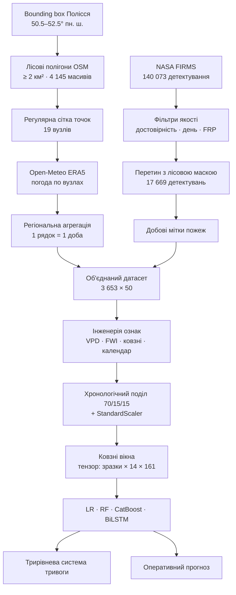

# 🔥 Polissya Wildfire Risk

**Динамічна система прогнозування ризику лісових пожеж на українському Поліссі на основі супутникових детектувань та даних метеорологічного реаналізу.**

[](https://www.python.org/)
[](https://www.tensorflow.org/)
[](LICENSE)
[](#про-проєкт)

*[English version](README.md)*


<sub>Робота навченої моделі на відкладеному тестовому періоді 2024–2025. Червона лінія — прогнозована добова ймовірність значної пожежної активності; чорні точки — доби, коли NASA FIRMS фактично зафіксував пожежі в межах лісової маски. Кольорові смуги — три рівні тривоги.</sub>

---

## Коротко

Десять років щоденних метеоданих (2016–2025) по лісовій зоні Полісся об'єднано із супутниковими детектуваннями пожеж, щоб відповісти на одне питання: **наскільки ймовірна значна пожежна доба завтра, якщо відома погода за останні 14 днів?**

Двонаправлена LSTM досягає **ROC-AUC 0.877 та Recall 0.922** на строго хронологічній тестовій вибірці, перевершуючи логістичну регресію, випадковий ліс і CatBoost. Прогнози живлять трирівневу систему попередження, а окремий модуль підтягує актуальну погоду з Open-Meteo і видає поточний рівень ризику.

| | |
|---|---|
| **Регіон** | Українське Полісся, 50.5–52.5° пн. ш. / 23.5–34.0° сх. д. |
| **Період** | 2016-01-01 → 2025-12-31 (3 653 доби) |
| **Лісова маска** | 4 145 полігонів OSM ≥ 2 км², сумарно 58 276 км² |
| **Мітки пожеж** | 17 669 детектувань FIRMS у лісовій зоні, 468 значних пожежних діб |
| **Ознаки** | 161 предиктор, з них 121 сконструйовано |
| **Найкраща модель** | BiLSTM, 50 977 параметрів, вікно 14 діб |

---

## Про проєкт

Роботу виконано в рамках пілотування проєкту **Erasmus+ EcoMinds: Enhancing Environmental Data Collection through Machine Learning and Database Systems** як курсову роботу з дисципліни «Аналіз даних в інформаційно-управляючих системах» на **кафедрі інформатики та програмної інженерії КПІ ім. Ігоря Сікорського**.

Завдання EcoMinds передбачає повний цикл: знайти дані, очистити їх, побудувати модель, чесно оцінити та обміркувати практичну цінність результату. Цей репозиторій — увесь цей шлях в одному відтворюваному ноутбуці.

Повна пояснювальна записка (47 сторінок) лежить у [`docs/report/`](docs/report/), англомовний опис методології — у [`docs/METHODOLOGY.md`](docs/METHODOLOGY.md).

## Навіщо це потрібно

Полісся — торф'яний лісовий пояс півночі України. Він горить інакше, ніж звичайні помірні ліси: торф тримає вогонь під землею тижнями, весняні та пізньолітні пожежі повторюються за розкладом, а частина зони перекривається з Чорнобильською зоною відчуження, де пожежа є ще й подією перенесення радіонуклідів.

Служби ДСНС мають знати, куди завчасно перекидати сили, і при цьому ніхто не може тримати червоний рівень тривоги щодня. Система, яка правильно вгадує **коли** треба хвилюватися, цінніша за систему з високою «середньою точністю». Саме тому в оцінюванні пріоритет надано повноті (Recall) на пожежних добах.

## Джерела даних

| Джерело | Що дає | Як використано |
|---|---|---|
| [Open-Meteo Historical Weather API](https://open-meteo.com/en/docs/historical-weather-api) | Реаналіз ERA5, ~25 км, безкоштовно | Погода для кожного вузла сітки, 2016–2025 |
| [Open-Meteo Forecast API](https://open-meteo.com/en/docs) | Свіжі спостереження та короткостроковий прогноз | Модуль оперативного прогнозу (Фаза 5) |
| [NASA FIRMS](https://firms.modaps.eosdis.nasa.gov/) | Активні пожежі з MODIS та VIIRS | Цільова змінна |
| [OpenStreetMap](https://www.openstreetmap.org/) через OSMnx | Полігони `landuse=forest`, `natural=wood` | Просторова маска зони дослідження |

Усі джерела відкриті. FIRMS потребує [безкоштовного MAP_KEY](https://firms.modaps.eosdis.nasa.gov/api/map_key/), решта працює без реєстрації.

## Конвеєр обробки



## Зона дослідження

Наївний підхід — взяти кілька міст і завантажити їхню погоду. Але це вимірює погоду міст, а не лісів.

Натомість зону визначено як перетин трьох умов: bounding box Полісся, лісові полігони OSM площею не менше 2 км² (це відсікає парки та лісосмуги) та адміністративний кордон України. Залишається **4 145 лісових масивів на 58 276 км²**. Усередині маски будується регулярна сітка з **19 вузлів**, кожен приблизно відповідає одній клітинці ERA5.

Open-Meteo приймає координату, а не полігон, тому «погода зони» апроксимується усередненням достатньо щільної сітки. Для кожної змінної зберігаються середнє, регіональний максимум та регіональний мінімум: пожежа починається там, де умови найгірші, а не там, де вони середні.

Дві інженерні деталі роблять ноутбук придатним до повторного запуску в звичайній сесії Colab. Геометрії спрощуються з допуском ~100 м перед `unary_union`, інакше об'єднання десятків тисяч деталізованих полігонів вичерпує пам'ять. І кожна відповідь API кешується на Drive, тож повторний запуск займає секунди замість 100 запитів.

## Формування міток

FIRMS — це потік детектувань, а не база даних пожеж, тому 140 073 сирих записи потребують обробки:

| Фільтр | Залишилось | Частка |
|---|---|---|
| Сирі детектування в bbox | 140 073 | 100.0% |
| Рівень достовірності | 119 132 | 85.0% |
| Лише денні спостереження | 78 734 | 66.1% |
| Яскравісна температура ≥ 300 K | 78 734 | 100.0% |
| **У межах лісової маски** | **17 669** | **22.4%** |

Останній рядок — ключовий. Лише близько п'ятої частини теплових аномалій регіону є лісовими пожежами. Решта — переважно випалювання стерні на полях, яке підпорядковане графіку жнив, а не пожежній погоді. Якби ці точки лишились у цільовій змінній, модель вивчила б сільськогосподарський календар.

Після просторової фільтрації 1 165 діб містять хоча б одне детектування (31.9%). Для моделювання використано суворішу бінарну ціль — **значна пожежна доба**, яка позитивна для 468 діб (12.8%). Найпотужніша подія десятиліття сягнула 2 174 МВт FRP.

## Розвідувальний аналіз

Десять візуалізацій до початку моделювання. Чотири найінформативніші:

<table>
<tr>
<td width="50%"><br/><sub><b>Сезонність.</b> Пожежні доби за роками та місяцями. Два піки: весняний після сходу снігу до появи зелені та сильніший пізньолітній у серпні–жовтні.</sub></td>
<td width="50%"><br/><sub><b>STL-декомпозиція</b> пожежної активності на тренд, річну сезонність і залишок: підтверджено стабільний 365-денний цикл.</sub></td>
</tr>
<tr>
<td width="50%"><br/><sub><b>Автокореляція.</b> Саме зріз PACF задав довжину вхідного вікна у 14 діб. Це вибір за даними, а не кругле число.</sub></td>
<td width="50%"><br/><sub><b>Розділення класів.</b> Розподіли погодних умов у пожежні та спокійні доби. Найчіткіше класи розділяють вологість і VPD.</sub></td>
</tr>
</table>

<details>
<summary><b>Інші графіки EDA</b> (кореляційна матриця, щільності, роза вітрів)</summary>


*Рангова кореляція Спірмена між метеорологічними предикторами. Саме Спірмена, бо низка залежностей тут монотонна, але не лінійна.*


*Ядерні оцінки щільності ключових предикторів за класами.*


*Роза вітрів для діб зі значною пожежною активністю.*

</details>

Розширений тест Дікі-Фуллера відхиляє гіпотезу одиничного кореня для температури (p = 3.9e-03) і відносної вологості (p = 2.0e-07), тобто ряди достатньо стаціонарні для прямого моделювання.

## Інженерія ознак

Із сирої погоди отримано 121 похідну ознаку, після відбору лишився 161 предиктор:

- **Дефіцит тиску пари (VPD)** за рівнянням Тетенса. Середнє 0.381 кПа, максимум 1.80 кПа. VPD фізично ближчий до «швидкості висихання пального», ніж окремо температура чи вологість.
- **Канадська система FWI**, повний рекурсивний ланцюг FFMC → DMC → DC → ISI → BUI → FWI за Van Wagner & Pickett (1985). Кожен день залежить від попереднього, тому ряд проходиться послідовно з передачею стану. Середній FWI 2.55, максимум 30.3.
- **Тривалість бездощових періодів**, доби з опадами менше 1 мм. Найдовший період десятиліття — 21 доба.
- **Ковзні статистики** на вікнах 3, 7 і 14 діб: середні, стандартні відхилення та кумулятивні суми опадів. 108 ознак.
- **Циклічне кодування календаря**: синус і косинус дня року, щоб 31 грудня стояло поруч із 1 січня.

Усі похідні від пожеж колонки вилучено з простору предикторів. На вхід іде лише погода — саме це робить систему прогнозом, а не описом.

## Моделювання

**Поділ строго хронологічний.** Навчання: 2016-01-01 — 2022-12-31, валідація: 2023-01-01 — 2024-07-01, тест: 2024-07-02 — 2025-12-31. Випадкове перемішування часового ряду дозволило б моделі побачити погоду наступного тижня під час прогнозу на сьогодні та завищило б усі метрики.

Масштабувальник навчається лише на тренувальній вибірці. Ковзні вікна у 14 діб перетворюють кожну підвибірку на тривимірний тензор форми `(зразки, 14, 161)`: 2 543 / 534 / 534 зразки. Вага позитивного класу 7.59 штрафує пропуски пожежних діб.

Чотири моделі змагаються на однакових тензорах; для трьох класичних вікно розгортається у 2 254 ознаки, і лише BiLSTM бачить часову вісь як часову:

```
Bidirectional(LSTM(32))   →  49 664 параметри
BatchNormalization        →     256
Dropout(0.3)
Dense(16, relu)           →   1 040
Dropout(0.2)
Dense(1, sigmoid)         →      17
                          ─────────
Разом                        50 977
```

Поріг класифікації підібрано максимізацією F1 **на валідаційній вибірці** й застосовано без змін до тестової. Жодне рішення не приймалося з використанням тестових даних.


## Результати

Усі метрики на недоторканій тестовій вибірці 2024–2025, де базова частота значних пожежних діб становить 19.3%.

| Модель | ROC-AUC | Avg. Precision | Precision | Recall | F1 |
|---|---|---|---|---|---|
| Logistic Regression | 0.748 | 0.415 | 0.407 | 0.534 | 0.462 |
| Random Forest | 0.872 | 0.529 | 0.524 | 0.107 | 0.177 |
| CatBoost | 0.834 | **0.607** | 0.396 | 0.650 | 0.493 |
| **BiLSTM** ⭐ | **0.877** | 0.577 | 0.401 | **0.922** | **0.559** |


Чесне прочитання таблиці:

- **BiLSTM виграє там, де це важливо.** Найкращі AUC та F1, а Recall 0.922 означає виявлення приблизно 9 із 10 реальних пожежних діб. Хибна тривога коштує зайвого патрулювання, пропуск коштує лісу.
- **Random Forest — показовий контрприклад.** AUC 0.872 виглядає конкурентно, але Recall 0.107 означає пропуск майже 90% пожежних діб на робочому порозі. Якість ранжування і якість рішень — різні речі.
- **CatBoost має найкращу Average Precision**, тож за пріоритету точності обирати варто його.
- **Precision близько 0.40 в усіх моделей.** Приблизно три з п'яти тривог хибні. Це реальне обмеження й ціна налаштування на повноту для рідкісної події.

Перевага рекурентної архітектури пояснюється тим, що лише вона бачить часову структуру явно. Ризик пожежі накопичувальний: два сухі тижні — це не те саме, що два сухі дні, повторені сім разів.

## Що саме вивчила модель

Permutation importance для BiLSTM (20 перемішувань на ознаку, середнє падіння AUC):


| # | Ознака | ΔAUC |
|---|---|---|
| 1 | Ст. відхилення мін. регіональних опадів за 14 діб | 0.0144 ± 0.0021 |
| 2 | Максимальна відносна вологість | 0.0083 ± 0.0030 |
| 3 | Мінімальна регіональна вологість | 0.0082 ± 0.0024 |
| 4 | Тривалість сонячного сяйва | 0.0079 ± 0.0018 |
| 5 | Ст. відхилення макс. регіональної температури за 14 діб | 0.0079 ± 0.0020 |

Найважливішою виявилась міра **мінливості**, а не рівня: важливіше, наскільки нерівномірно випадали опади за два тижні, ніж скільки їх випало. Рівномірна мжичка тримає підстилку вологою; та сама сума, що випала однією зливою з наступними дванадцятьма сухими днями, — ні. Компоненти FWI (DC та власне FWI, ΔAUC ≈ 0.0053) також дають внесок, що є незалежним підтвердженням придатності канадського індексу 1985 року для українського торф'яного лісу.

## Від ймовірності до тривоги

| Рівень | Ймовірність | Рекомендована дія | Частка тестового періоду |
|:---:|---|---|---|
| 🟢 **Зелений** | < 0.30 | Звичайний моніторинг | 268 діб (50.2%) |
| 🟠 **Помаранчевий** | 0.30 – 0.70 | Обмеження відвідування лісу, готовність бригад | 194 доби (36.3%) |
| 🔴 **Червоний** | > 0.70 | Превентивне залучення авіації та пожежників | 72 доби (13.5%) |

Половина календаря лишається зеленою, червоний спалахує приблизно раз на сім діб. Система, яка кричить постійно, перестає працювати.

## Оперативний прогноз

Фаза 5 замикає цикл: підтягує актуальну погоду для тих самих 19 вузлів і рахує сьогоднішній рівень ризику.

Найскладніше тут — «розігрів». Індекси FWI рекурсивні, а ковзні вікна потребують історії, тому оцінка ізольованого тижня дала б безглузді значення. Модуль додає 400-денний історичний хвіст перед перерахунком ознак, чого достатньо для збіжності Drought Code. Пожежні колонки з цього хвоста вилучаються, щоб уникнути витоку міток.


<sub>Результат останнього зафіксованого запуску, 18.05.2026: ймовірність 51.6%, помаранчевий рівень. Ноутбук також експортує анімовану карту `risk_animation.html`.</sub>

## Структура репозиторію

```
polissya-wildfire-risk/
├── notebooks/
│   └── polissya_wildfire_risk.ipynb    # повний конвеєр, фази 0–5
├── src/
│   ├── fwi.py                          # канадська система індексів FWI
│   ├── features.py                     # VPD, бездощові періоди, ковзні, календар
│   └── config.py                        # bbox, дати, пороги
├── docs/
│   ├── METHODOLOGY.md                  # методологія англійською
│   ├── RESULTS.md                      # повні метрики та відтворення
│   └── report/
│       └── coursework-report-uk.docx   # пояснювальна записка, 47 сторінок
├── assets/                             # графіки для README
├── requirements.txt
├── CITATION.cff
└── LICENSE
```

## Як запустити

### У Google Colab

Ноутбук написано під Colab і він монтує Drive для кешування. Відкрийте [`notebooks/polissya_wildfire_risk.ipynb`](notebooks/polissya_wildfire_risk.ipynb), додайте ключ FIRMS у Colab Secrets як `FIRMS_MAP_KEY` і виконайте всі комірки.

### Локально

```bash
git clone https://github.com/<ваш-нік>/polissya-wildfire-risk.git
cd polissya-wildfire-risk

python -m venv .venv && source .venv/bin/activate
pip install -r requirements.txt

export FIRMS_MAP_KEY="ваш_ключ"
jupyter lab notebooks/polissya_wildfire_risk.ipynb
```

Поза Colab монтування Drive коректно пропускається, і робочою директорією стає `./forest_fire_project`.

### Використання модулів окремо

```python
import pandas as pd
from src.fwi import add_fwi
from src.features import compute_vpd, days_without_rain, add_rolling, add_calendar

df = pd.read_csv("weather.csv", parse_dates=["date"])
df["vpd"] = compute_vpd(df["temperature_2m_mean"], df["relative_humidity_2m_mean"])
df = add_fwi(df)          # додає FFMC, DMC, DC, ISI, BUI, FWI
```

## Обмеження

- **Precision близько 0.40.** Приблизно три з п'яти тривог не підтверджуються детектуванням.
- **Роздільність ERA5 ~25 км** не дозволяє бачити мікроклімат усередині лісового масиву.
- **Немає антропогенних предикторів**: щільності населення, доступності доріг, ліній електропередач. Модель прогнозує пожежну погоду й спирається на те, що джерела займання присутні завжди.
- **Мітка є проксі.** FIRMS не бачить малі, нічні та закриті хмарами пожежі.
- **Один регіон, одне десятиліття.** Торф робить Полісся нетиповим, тож перенесення на інші зони не перевірено.
- **Це дослідницький прототип**, а не сертифіковане операційне ПЗ.

## Плани розвитку

- [ ] Антропогенні предиктори (населення, дороги, ЛЕП)
- [ ] Спеціалізовані індекси вологості торфовищ
- [ ] Перехід від регіонального ряду до просторово-розподілених прогнозів
- [ ] Історія попередніх пожеж як ознака
- [ ] Калібрування ймовірностей (Platt / isotonic)
- [ ] Оформлення оперативного модуля як планового завдання з дашбордом

## Автори та ліцензія

**Сітайло Ангеліна Сергіївна** (ІП-42) та **Чередніченко Артем Олегович** (ІП-41)
Спеціальність 121 «Інженерія програмного забезпечення», КПІ ім. Ігоря Сікорського

Керівники: доц. Ліхоузова Т. А., доц. Олійник Ю. О.
Виконано в рамках **Erasmus+ EcoMinds**, Київ, 2026.

Код поширюється за ліцензією [MIT](LICENSE). Дані належать їхнім постачальникам: NASA FIRMS, Open-Meteo (CC BY 4.0), учасники OpenStreetMap (ODbL).
